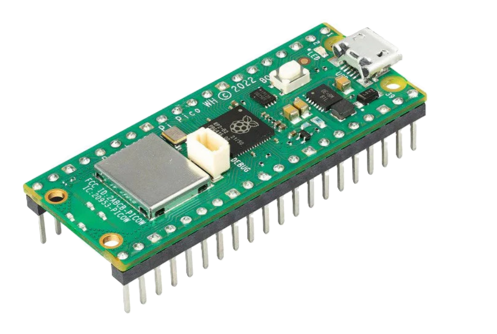
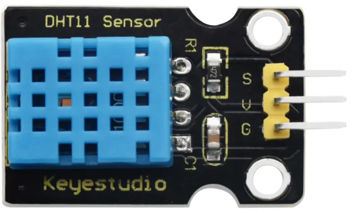
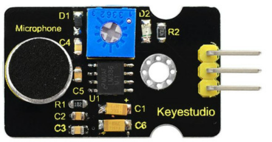
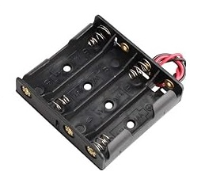
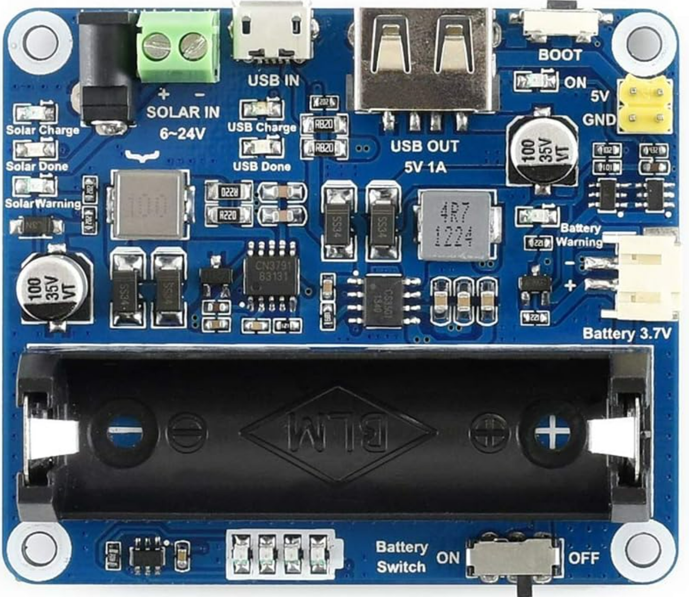
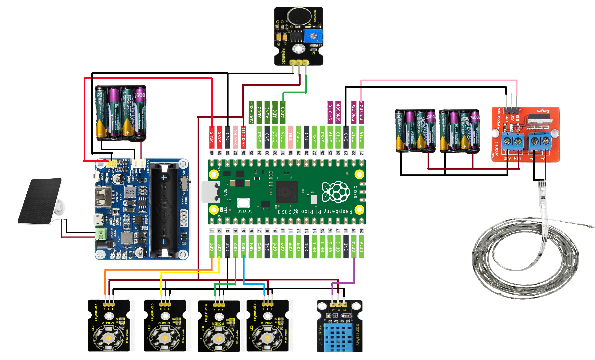
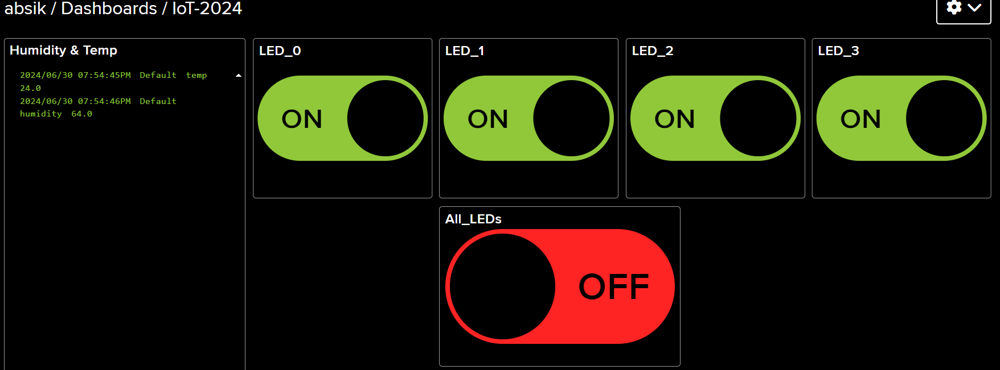
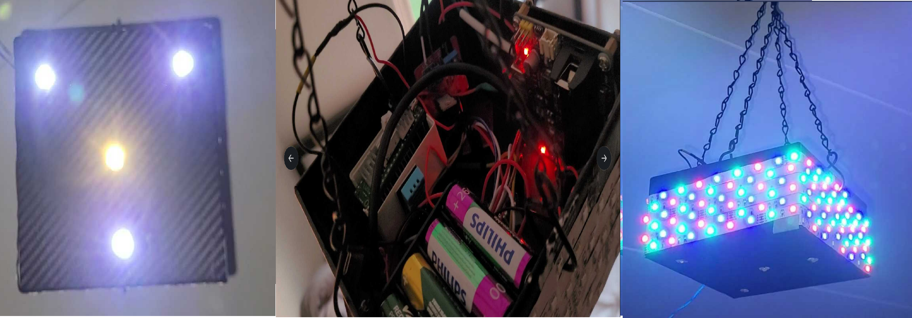

# Real-Time Smart Light Box Management

[Mohamed Absi Kassas], mk224zw

## Short Project Overview

The Real-Time Smart Light Box Management project leverages IoT technology to monitor and control environmental conditions. Utilizing a microcontroller, various sensors, LEDs, and a power management system, this project aims to create a responsive and efficient smart lighting system.

**Estimated Time to Complete**: Approximately 20-25 hours.

---

## Objective

### Why I Chose the Project
This project was chosen to delve into the integration of IoT devices for real-time monitoring and control. Focusing on environmental sensors and smart lighting provides insights into the development of automated, efficient, and responsive systems.

#### Purpose
The primary goal is to develop a smart system capable of:
- Monitoring temperature and humidity levels.
- Controlling LED lights based on sensor data and remote commands.
- Managing power consumption effectively using renewable energy sources.

#### Expected Insights
The project aims to provide insights into:
- Real-time environmental conditions.
- Automated lighting control to optimize energy usage.
- Potential applications in smart homes and industrial settings.

---

## Materials

### List of Materials and Specifications

| Image                                                      | Component                   | Description                                      | Cost  |
|------------------------------------------------------------|-----------------------------|--------------------------------------------------|-------|
|                     | Raspberry Pi Pico W         | The main controller for the project               | 100kr |
|                   | DHT11 Sensor                | Measures temperature and humidity                 | 50kr  |
|                   | LED Light Strip (5m)        | Controlled via sound waves                        | 120kr |
|                   | 3W LEDs (4 units)           | Controlled via Adafruit ON/OFF switch             | 200kr |
|                   | Microphone                  | Measures sound via ADC                            | 48kr  |
|                   | Miscellaneous Wires         | For connecting components                         | 40kr  |
|                   | Ni-Mh Battery (2100mA, 12 units) | Powers the Raspberry Pi Pico and peripherals | 350kr |
|                   | Battery Holder (3 units)    | Holds batteries to create power source            | 150kr |
|                   | Solar Panel                 | Used for charging batteries                       | 300kr |
|                  | Power Management Controller | Controls power for charging batteries            | 200kr |
|                  | IRF520 MOSFET Driver Module | Drives the LED light strip                        | 60kr  |


### Material Details

1. **Raspberry Pi Pico W**  
   The main controller, managing all connected sensors and actuators for real-time monitoring and control.  
   **Cost:** 100kr

2. **DHT11 Sensor**  
   Measures temperature and humidity levels within the environment, aiding in environmental control decisions.  
   **Cost:** 50kr

3. **LED Light Strip (5m)**  
   A 5-meter LED light strip controlled via sound waves for dynamic lighting based on ambient sound levels.  
   **Cost:** 120kr

4. **3W LEDs (4 units)**  
   High-power LEDs controlled through an Adafruit ON/OFF switch, used for focused lighting.  
   **Cost:** 200kr

5. **Microphone**  
   Captures sound levels, processed via the ADC to control LED brightness based on ambient noise.  
   **Cost:** 48kr

6. **Miscellaneous Wires**  
   Essential for connecting components, ensuring stable and reliable electrical connections.  
   **Cost:** 40kr

7. **Ni-Mh Battery (2100mA, 12 units)**  
   Provides power to the Raspberry Pi Pico and peripherals for uninterrupted operation.  
   **Cost:** 350kr

8. **Battery Holder (3 units)**  
   Holds Ni-Mh batteries securely, creating a stable power source.  
   **Cost:** 150kr

9. **Solar Panel**  
   Charges the batteries, promoting sustainable energy use and extending system operational time.  
   **Cost:** 300kr

10. **Power Management Controller**  
    Manages power flow for charging batteries and supplying power efficiently.  
    **Cost:** 200kr

11. **IRF520 MOSFET Driver Module**  
    Used to drive the LED light strip with the Raspberry Pi Pico W, providing efficient control of high-power LEDs.  
    **Cost:** 60kr
   
---

## Computer Setup

### Chosen IDE
- **IDE**: Visual Studio Code with C/C++ extension.

### Steps for Setup

1. **Install CMake**
   - Install CMake, a tool to control the software compilation process using simple platform and compiler-independent configuration files.
   - For Linux: `sudo apt-get install cmake`
   - For macOS: `brew install cmake`
   - For Windows: Download and install from the [official website](https://cmake.org/download/).

2. **Install ARM GCC Toolchain**
   - Install the ARM GCC toolchain (GCC 12.2.1 arm-none-eabi) which is required for compiling the code for the Raspberry Pi Pico.
   - Download and install from the [ARM developer website](https://developer.arm.com/tools-and-software/open-source-software/developer-tools/gnu-toolchain/gnu-rm).
   - Ensure the toolchain binaries are added to your system PATH.

3. **Install Visual Studio Code**
   - Download and install Visual Studio Code from the [official website](https://code.visualstudio.com/).
   - For Linux, you can install it using the package manager.
     - For Debian-based systems: `sudo apt install code`
     - For Red Hat-based systems: `sudo dnf install code`
   - For macOS: `brew install --cask visual-studio-code`

4. **Install C/C++ Extension in Visual Studio Code**
   - Open Visual Studio Code.
   - Go to the Extensions view by clicking on the Extensions icon in the Activity Bar on the side of the window or press `Ctrl+Shift+X`.
   - Search for "C/C++" and click "Install" on the extension by Microsoft.

5. **Set Up the CMake Environment for Raspberry Pi Pico**
   - Open a terminal in Visual Studio Code.
   - Clone the Raspberry Pi Pico SDK:
     ```sh
     git clone -b master https://github.com/raspberrypi/pico-sdk.git
     cd pico-sdk
     git submodule update --init
     ```
   - Set the environment variable to point to the Pico SDK:
     ```sh
     export PICO_SDK_PATH=/path/to/pico-sdk
     ```
   - Clone your project repository or create a new directory for your project:
     ```sh
     mkdir my-pico-project
     cd my-pico-project
     mkdir build
     ```
   - Create a `CMakeLists.txt` file in your project directory to configure the build process.

6. **Install Dependencies**
   - Ensure libraries for FreeRTOS are available. You can include FreeRTOS as a submodule in your project.
     ```sh
     git submodule add https://github.com/FreeRTOS/FreeRTOS-Kernel.git
     git submodule update --init
     ```

7. **Configure and Build the Project Using CMake**
   - In the terminal, navigate to the `build` directory inside your project directory.
     ```sh
     cd build
     ```
   - Configure the project using CMake:
     ```sh
     cmake ..
     ```
   - Build the project:
     ```sh
     make
     ```

8. **Flashing Firmware**
   - Connect your Raspberry Pi Pico to your computer via USB while holding down the BOOTSEL button.
   - Copy the generated `.uf2` file from the `build` directory to the Pico's storage.
     - The Pico will appear as a removable drive on your computer.
     - Drag and drop the `.uf2` file onto this drive.
   - Alternatively, you can automate this process using `picotool`:
     ```sh
     picotool load build/my-pico-project.uf2
     ```

---

## Putting Everything Together

### Circuit Diagram
The circuit diagram provides a detailed view of all the component connections, including:

- **DHT11 Sensor**: Connections to the Raspberry Pi Pico for reading temperature and humidity.
- **3W LEDs**: Connected to GPIO pins for controlling individual LEDs.
- **IRF520 MOSFET Driver Module**: Connected to the LED light strip and the Raspberry Pi Pico, facilitating efficient control of high-power LEDs.
- **Power Supply**: Connections for powering the Raspberry Pi Pico and peripherals, including battery and solar panel integration.

 

### Description

The project involves several key connections and configurations, each component playing a crucial role in the overall functionality of the system:

- **DHT11 Sensor**:
  - **Function**: Measures temperature and humidity.
  - **Connection**: Connected to GPIO pin 14 on the Raspberry Pi Pico for data input.

- **3W LEDs**:
  - **Function**: Provides high-intensity lighting controlled by the microcontroller.
  - **Connection**: Connected to GPIO pins 0, 1, 2, and 3 for individual control.

- **LED Strip**:
  - **Function**: Provides ambient lighting with brightness control.
  - **Connection**: Connected to GPIO pin 16, controlled via PWM for dynamic brightness adjustment based on ambient sound levels.
  - **Control Method**: Brightness adjustment based on ADC readings from a microphone connected to ADC pin 26.

- **Microphone**:
  - **Function**: Captures ambient sound levels to adjust LED brightness dynamically.
  - **Connection**: Connected to ADC pin 26 on the Raspberry Pi Pico for sound level measurement.

- **IRF520 MOSFET Driver Module**:
  - **Function**: Drives the LED light strip, allowing efficient handling of high current requirements.
  - **Connection**: Interfaces between the LED strip and GPIO pin 16 on the Raspberry Pi Pico, facilitating power control.

- **Power Management**:
  - **Function**: Ensures stable power supply to the system using batteries and a solar panel.
  - **Connection**: Batteries and solar panel are connected to the power management controller, which regulates the power supplied to the Raspberry Pi Pico and other components.

---

## Platform

### Platform Choice
- **Local Installation**: Using a local MQTT server (Mosquitto) on a computer or Raspberry Pi.
- **Comparison**: Evaluated cloud-based MQTT services like HiveMQ, but chose local for ease of control and no subscription cost.

### Functionality
- **Local Installation**: Ensures low latency and full control over the server.
- **Scaling**: Can move to cloud-based services if higher scalability is needed.

---

## The Code

### Core Functions
- **Temperature and Humidity Reading**: Uses the DHT11 sensor to get environmental data.
  ```cpp
  void dht_task(dht_reading *result) {
  (void)pvParameters;

  dht_reading reading;

  while (1)
  {
    read_from_dht(&reading);
    float fahrenheit = (reading.temp_celsius * 9 / 5) + 32;
    printf("Humidity = %.1f%%, Temperature = %.1fC (%.1fF)\n",
           reading.humidity, reading.temp_celsius, fahrenheit);

    // Assign values to global variables
    g_temperature = reading.temp_celsius;
    g_humidity = reading.humidity;

    vTaskDelay(pdMS_TO_TICKS(1500));
  }
  }
  ```

- **WiFi and MQTT Setup**: Connects to WiFi and MQTT server for data transmission.
  ```cpp
  void wifi_task(void) {
    // Connect to Wi-Fi
    cyw43_arch_init();
    cyw43_arch_enable_sta_mode();

    // Connect to the Wi-Fi network - loop until connected
    while (cyw43_arch_wifi_connect_timeout_ms(WIFI_SSID, WIFI_PASSWORD, CYW43_AUTH_WPA2_AES_PSK, 30000) != 0)
    {
        printf("Attempting to connect...\n");
    }

    // Print a success message once connected
    printf("Connected to Wi-Fi\n");
    wifi_connected = true;
  }
  ```

- **LED Control**: Controls LEDs based on received MQTT messages.
  ```cpp
  static void mqtt_pub_data_cb(void *arg, const u8_t *data, u16_t len, u8_t flags) {
    if (data_in > 0)
    {
        data_in -= len;
        memcpy(&buffer[data_len], data, len);
        data_len += len;

        if (data_in == 0)
        {
            buffer[data_len] = '\0'; // Ensure null termination for string operations
            printf("Message received: %s\n", buffer);

            // Check if the message is "All_ON" or "All_OFF"
            if (strcmp((char *)buffer, "All_ON") == 0)
            {
                gpio_put(LED0, 1);
                gpio_put(LED1, 1);
                gpio_put(LED2, 1);
                gpio_put(LED3, 1);
                gpio_put(Led_Strip, 1);
            }
            else if (strcmp((char *)buffer, "All_OFF") == 0)
            {
                gpio_put(LED0, 0);
                gpio_put(LED1, 0);
                gpio_put(LED2, 0);
                gpio_put(LED3, 0);
                gpio_put(Led_Strip, 0);
            }
            else if (strcmp((char *)buffer, "LED0_ON") == 0)
            {
                gpio_put(LED0, 1);
            }
            else if (strcmp((char *)buffer, "LED0_OFF") == 0)
            {
                gpio_put(LED0, 0);
            }
            else if (strcmp((char *)buffer, "LED1_ON") == 0)
            {
                gpio_put(LED1, 1);
            }
            else if (strcmp((char *)buffer, "LED1_OFF") == 0)
            {
                gpio_put(LED1, 0);
            }
            else if (strcmp((char *)buffer, "LED2_ON") == 0)
            {
                gpio_put(LED2, 1);
            }
            else if (strcmp((char *)buffer, "LED2_OFF") == 0)
            {
                gpio_put(LED2, 0);
            }
            else if (strcmp((char *)buffer, "LED3_ON") == 0)
            {
                gpio_put(LED3, 1);
            }
            else if (strcmp((char *)buffer, "LED3_OFF") == 0)
            {
                gpio_put(LED3, 0);
            }
            // Reset buffer for next message
            data_len = 0;
        }
    }
  }
  ```

### Explanation
- **WiFi Task**: Handles connecting to WiFi.
- **DHT Task**: Continuously reads temperature and humidity data and updates global variables.
- **Light Control**: Adjusts LED brightness based on sound levels and MQTT messages.

---

## Transmitting the Data / Connectivity

### Data Transmission
- **Frequency**: Data sent every 10 seconds.
- **Wireless Protocols**: Uses WiFi for connectivity.
- **Transport Protocols**: MQTT for messaging.
- **Design Choices**: MQTT chosen for its lightweight nature and ease of use with IoT devices.

---

## Presenting the Data

### Dashboard
- **Visualization**: Data displayed on a web-based dashboard using libraries like Chart.js or Google Charts.
- **Database**: Data stored locally using SQLite for simplicity.
- **Data Saving Frequency**: Every 10 seconds.

### Example Dashboard

---

### Functional Testing
#### Testing Steps:
1. **Component Testing**: Verify each component individually to ensure they function correctly.
   - **DHT11 Sensor**: Confirm it accurately measures temperature and humidity.
   - **LEDs**: Test LED brightness control via GPIO pins.
   - **Microphone**: Ensure it captures sound levels accurately.
2. **Integration Testing**: Combine components and verify overall system functionality.
   - **Data Communication**: Ensure the Raspberry Pi Pico correctly processes input from the DHT11 sensor and microphone.
   - **Output Control**: Verify the LEDs respond accurately to the processed data.
3. **Power Management Testing**: Check the power management system's efficiency.
   - **Battery Charging**: Ensure batteries are charging correctly via the solar panel.
   - **Power Supply**: Confirm the Raspberry Pi Pico and peripherals receive stable power.

### Final Build
#### Assembling the System
1. **Mount Components**: Secure all components on a stable surface or within an enclosure.
2. **Connect Components**: Using wires, connect the components as per the circuit diagram.
3. **Power Up**: Connect the power source and switch on the system.
4. **Upload Code**: Upload the final code to the Raspberry Pi Pico using the setup IDE.



### Troubleshooting
#### Common Issues and Solutions:
1. **Sensor Malfunction**: If sensors do not provide accurate readings, check connections and replace if necessary.
2. **LED Control Issues**: Ensure GPIO pin assignments in the code match the physical connections.
3. **Power Supply Problems**: Verify all power connections and ensure the power management system is functioning correctly.

---

### Summary
This project provides practical insights into integrating IoT components for real-time environmental monitoring and smart lighting control. Through this hands-on experience, you gain valuable skills in electronics, programming, and system integration, paving the way for advanced IoT projects.
